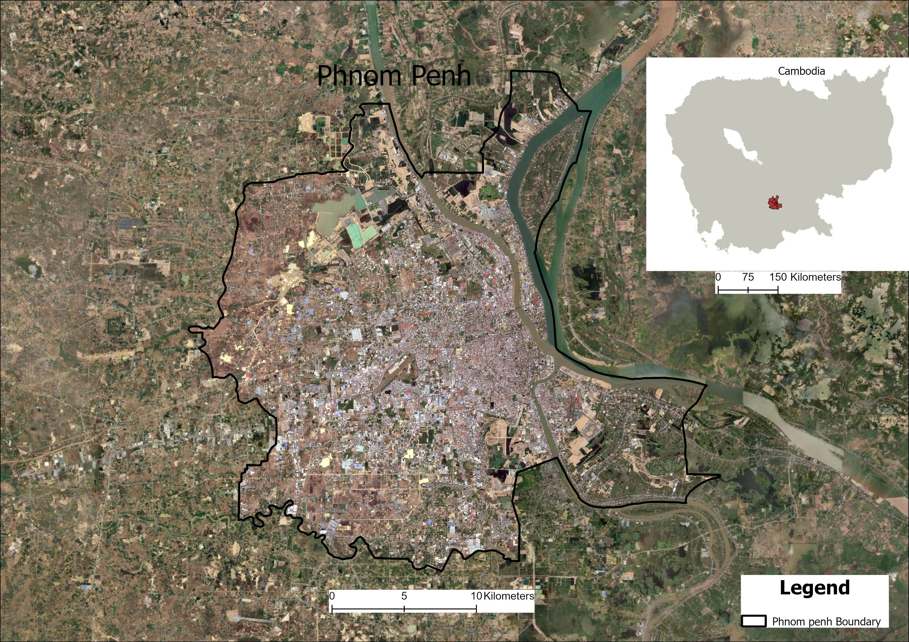
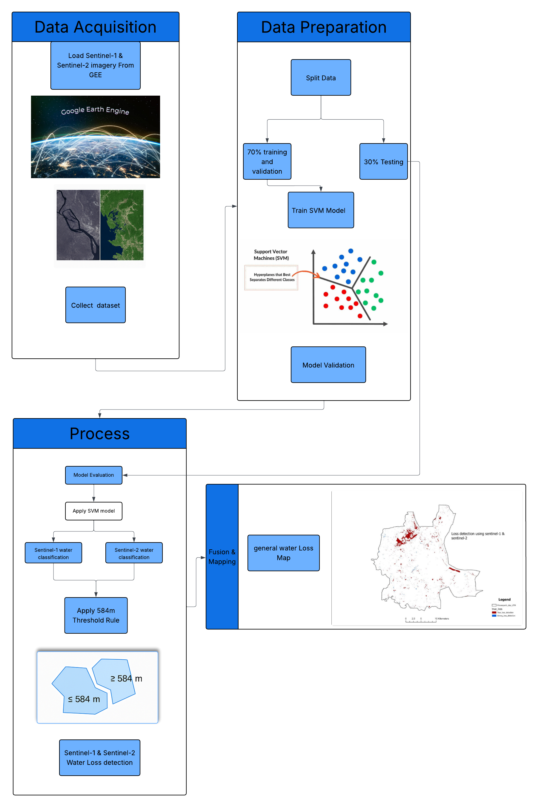

## about the study
This project focuses on detecting changes and loss in permanent water bodies within a tropical urban area using satellite remote sensing and machine learning. The study addresses the growing concern of diminishing water resources in urbanized tropical environments, where rapid development and climate variability often threaten the stability of natural water systems.

To improve accuracy and reliability, the project combines Sentinel-1 (Synthetic Aperture Radar) and Sentinel-2 (optical multispectral) data, leveraging the complementary strengths of both sensors. Sentinel-1 ensures consistent monitoring regardless of cloud cover or weather conditions, while Sentinel-2 provides high-resolution spectral information. By integrating these datasets, the model achieves robust classification performance in distinguishing between water and non-water pixels.

A Support Vector Machine (SVM) classifier was employed to detect permanent water bodies and assess their spatiotemporal changes. The analysis covers the period from 2016 to 2023, allowing for the detection of water loss, changes in extent, and patterns of urban encroachment on aquatic ecosystems.

The results contribute to better understanding the dynamics of urban water resources and can support urban planning, water resource management, and climate adaptation strategies in tropical regions.

## Area of study 

Phnom Penh, the capital of Cambodia, is located at the confluence of the Mekong, Tonlé Sap, and Bassac rivers, making water a defining feature of the city’s landscape and development. These rivers play a critical role in transportation, fisheries, agriculture, and the overall livelihood of the population. At the same time, Phnom Penh faces significant challenges related to seasonal flooding, riverbank erosion, and water resource management, which are intensified by rapid urban expansion and climate variability. Understanding the dynamics of water in this region is essential for sustainable growth and resilience planning.

  
   
  <em>Figure 1. Location map of Phnom Penh, Cambodia</em>

## Methodology and Workflow

The detection of water changes and loss in Phnom Penh was carried out through a series of steps combining data preparation, image preprocessing, classification, and change analysis:

1. **Data Collection**  
   - Satellite imagery covering the Phnom Penh region  
   - Training, validation, and testing datasets for model development  

2. **Classification with SVM**  
   - Implementation of a Support Vector Machine (SVM) classifier  
   - Training with collected samples to distinguish water vs. non-water areas  
   - Validation using independent datasets  

3. **Change Detection**  
   - Generation of multi-temporal water maps  
   - Comparison across time periods to quantify water change and loss  

4. **Accuracy Assessment**  
   - Evaluation of classification results using testing data  
   - Calculation of accuracy metrics (e.g., overall accuracy, kappa coefficient)  

   
  <em>Figure 2. Workflow for water change detection using remote sensing and SVM</em>

